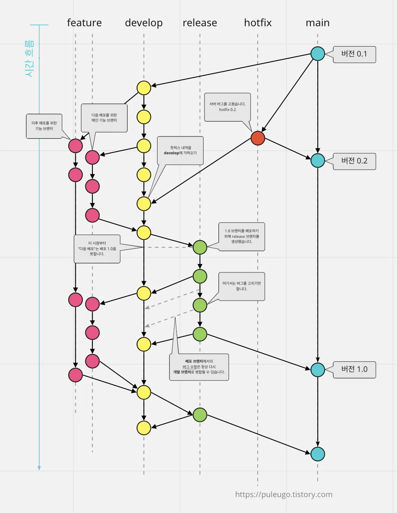

## Git Flow란?

브랜치를 역할별로 나눠 릴리스 중심으로 개발하는 전략이다

- main(master): 프로덕션 배포 이력
- develop: 통합 개발 브랜치(다음 릴리스 후보)
- feature/*: 단일 기능 개발용 단기 브랜치 → 완료 시 develop에 머지 후 삭제
- release/*: 릴리스 후보 안정화와 QA, 버전업 → 완료 시 main과 develop에 머지 후 삭제, main에 태그
- hotfix/*: 출시 후 긴급 수정 → main에서 분기, 수정 후 main에 머지하고 태그, develop에도 역머지

상시 존재: main, develop

필요 시 생성/삭제: feature/*, release/*, hotfix/*

브랜치 네이밍 예시

- feature/community, feature/authentication
- release/1.4.0
- hotfix/1.4.1
참고: feat:는 커밋 메시지 타입이며 브랜치 접두사로는 feature/를 권장

## main(master) 브랜치

- 출시 버전의 안정 코드 모음
- 한 번 생성하면 계속 사용
- 원칙: main에서는 직접 작업하지 않음. release/* 또는 hotfix/*를 PR로만 반영
- 태깅: vMAJOR.MINOR.PATCH 형태로 main에 태그 후 배포

## develop 브랜치

- 통합 개발 브랜치. 각 feature/* 결과가 모임
- 초기 1회 main에서 분기
- 일반적으로 release/*를 통해 main으로 반영

## feature 브랜치

- 단일 기능 개발용
- develop에서 분기 → 완료 시 develop에 PR 머지 → 브랜치 삭제

## release 브랜치

- 출시 전 최종 점검(QA), 버전업, 체인지로그 정리
- develop에서 릴리스에 포함할 기능이 고정된 시점에 분기
- 완료 시 main에 머지하고 태그, 동일 변경을 develop에도 머지 후 삭제

## hotfix 브랜치

- 출시 후 프로덕션 긴급 버그 대응
- main에서 분기 → 수정 → main에 머지하고 태그 → develop에도 역머지 → 삭제
- 일반 버그는 feature/* 또는 bugfix/*로 처리해 다음 릴리스에 포함

## Git Flow 이외 다른 전략들

팀과 제품 특성에 따라 GitHub Flow, GitLab Flow, Trunk-Based Development 등을 사용할 수 있음