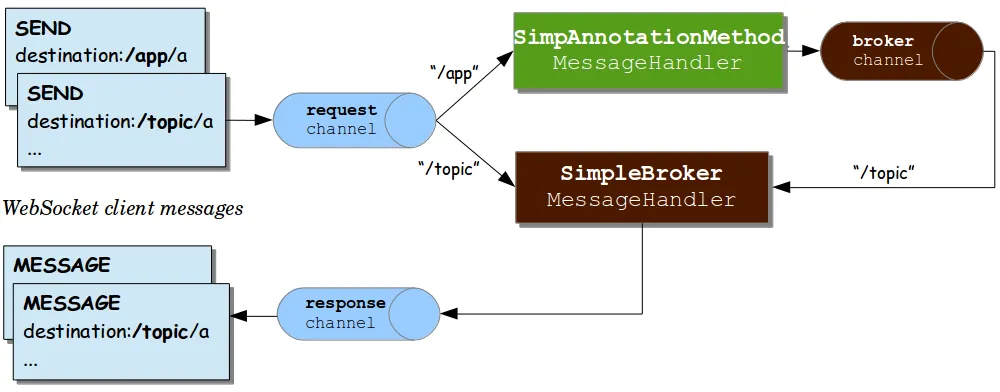

## STOMP (Simple Text Oriented Messaging Proto)란?

Frame 기반의 서브 프로토콜이다 (sub-protocol)

Spring은 WebSocket 사용 시 STOMP를 지원한다

- WebSocket 자체는 메시지를 주고받는 형식이 정해져 있지 않다
- WebSocket에서 클라이언트와 서버가 주고 받는 메시지의 형태를 약속한다

TCP, Web Socket과 같은 양방향 네트워크 프로토콜에서 사용될 수 있다

메시지 브로커를 활용하여 채팅을 위한 형식을 정의

- Publish-Subscribe 구조: 메시지를 공급하는 주체와 소비하는 주체를 분리하여 메시지를 제공한다
- Message BroKer: 발신자가 메시지를 발행하면 수신자들이 발행된 메시지를 수신하도록 메시지를 전달하는 주체

## STOMP의 Frame 구조

STOMP의 Frame은 Command, Header, Body로 구성됨

**Command**

- 종류:CONNECT, SEND, SUBSCRIBE, UNSUBSCRIBE 등

**Header**

- key:value 형태로 정보를 포함
- Header와 Body는 빈 줄로 구분

**Body**

- 데이터(Payload)가 포함된다
- Body의 마지막은 NULL 문자로 설정된다

## STOMP 기반의 통신 흐름

1. 구독자들이 특정 경로를 구독한다
2. 발신자가 메시지를 송신
3. 메시지가 서버 내에서 처리 과정을 거친 뒤, 혹은 즉각적으로 Message Broker에게 전달된다
4. Message Broker는 특정 경로를 구독하고 있는 모든 구독자들에게 전달받은 메시지를 송신한다s